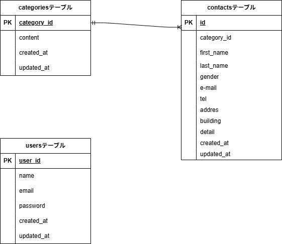

# アプリケーション名
お問い合わせフォーム（Laravel × Docker）

## 環境構築
```bash
# 1) 取得
git clone https://github.com/toji82/my-project.git
cd my-project

# 2) コンテナ起動（初回ビルド）
docker-compose up -d --build

# 3) Laravel 初期化（php コンテナ内）
docker-compose exec php bash

# 以降、コンテナ内
cd /var/www/html           # (= リポジトリの src/ がマウントされている想定)
composer install
cp .env.example .env
php artisan key:generate

# 4) .env 設定（docker-compose.yml に合わせる）
# DB_CONNECTION=mysql
# DB_HOST=mysql
# DB_PORT=3306
# DB_DATABASE=laravel_db
# DB_USERNAME=laravel_user
# DB_PASSWORD=laravel_pass

# 5) マイグレーション & シーディング
php artisan migrate --seed

# 終了してホストに戻る
exit
```  

使用技術(実行環境)
Laravel 8.x
PHP 8.0+（コンテナ内）
MySQL 8.0.26
Docker / Docker Compose（最新）
Node.js 20.x（フロントビルドが必要な場合）

ER図



URL
開発環境: http://localhost/

phpMyAdmin: http://localhost:8080/